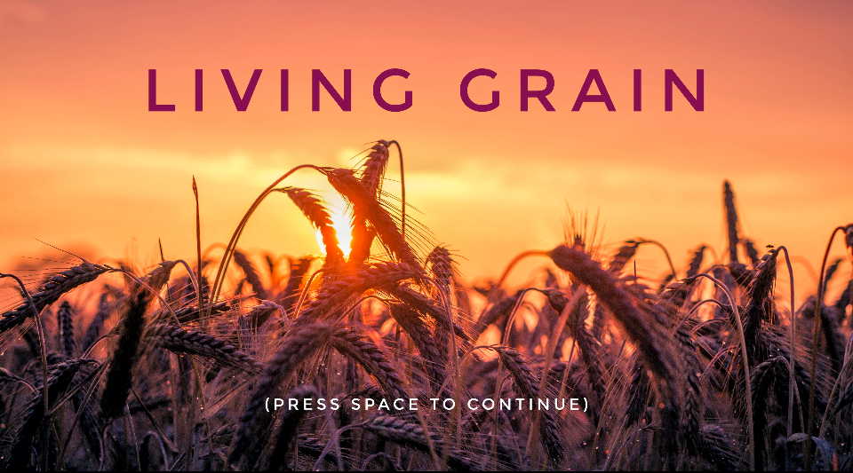
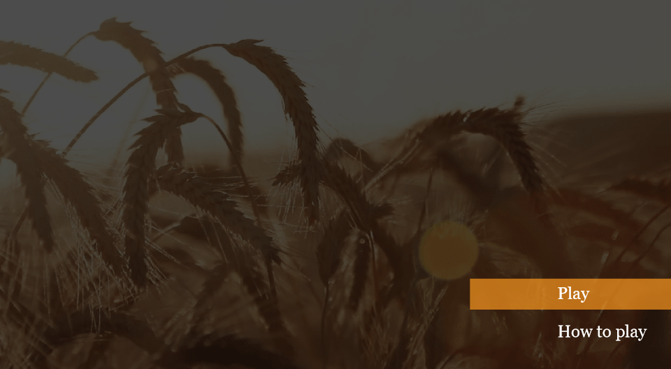
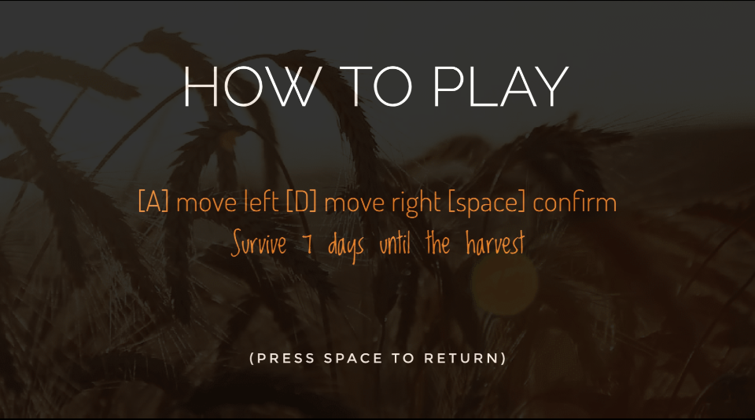
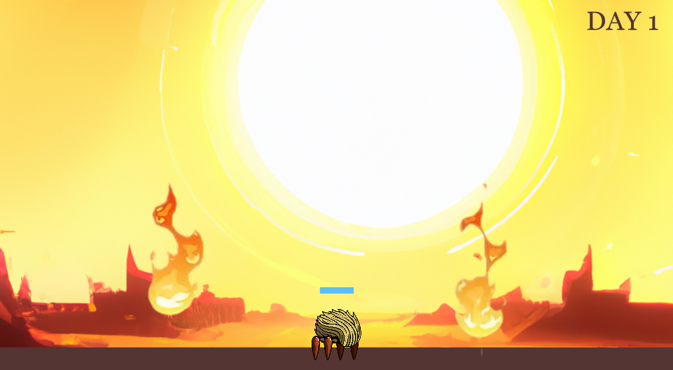
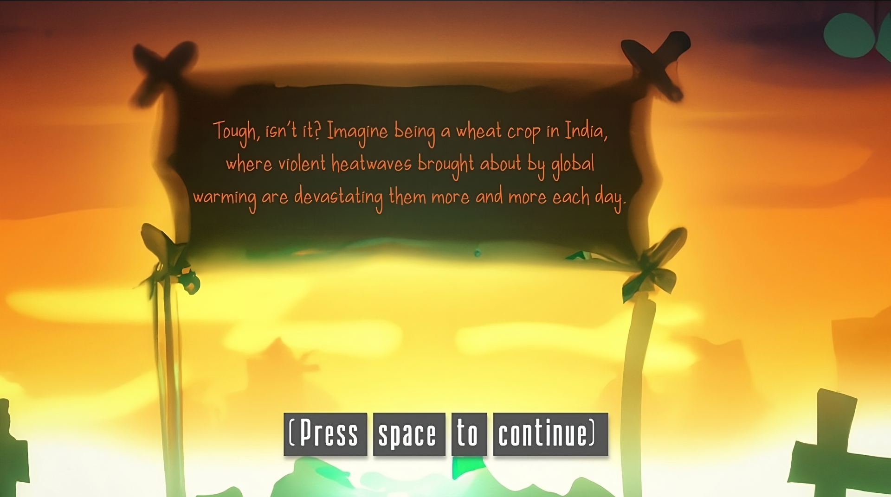
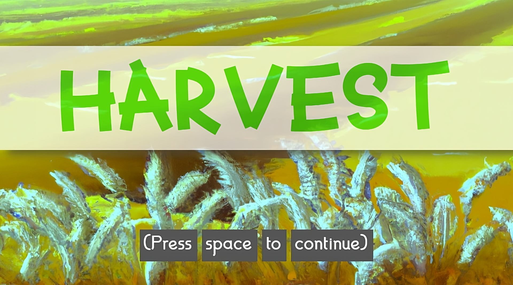

# SURYA
This is a 2D survival game where you must move your character to avoid hazards for seven days

## FEATURES
- Simple menu system
- controllable character that moves left and right
- animations for the menu, player, fireballs, and rain
- looping menu/game music as well as a variety of sound effects
- collision detection (player and fireballs, player and sides of screen)
- hazards in the form of fireballs
- healing in the form of rain

## HOW DO I GET THIS UP AND RUNNING?
- This game needs a server to run
- If using Visual Studio Code, use the Live Server extension

## SCREENSHOTS

### Start Screen

### Main Menu

### How to Play

### In-Game

### In-Game (Rain)
.png)

### Death Screen

### Victory Screen

